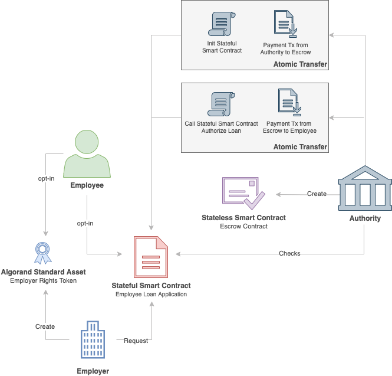

# Build an Employee Loan Arrangement DApp

## Overview
This solution will guide the reader through the design and the implementation of an
Algorand dApp created for the management of employee loans arrangements that involve companies,
employees, and national financial authorities.

This solution takes advantage of Algorand Standard Asset ([ASA](https://developer.algorand.org/docs/features/asa/)), Atomic Transfers ([AT](https://developer.algorand.org/docs/features/atomic_transfers/)) and Algorand Stateful and Stateless Smart Contracts ([ASC1](https://developer.algorand.org/docs/features/asc1/)), to simplify the process of employee loans arrangements.
The proposed solution make use of [goal CLI]() commands to deploy the application and interact with
its functions. The smart contracts source code is provided in [TEAL v3](https://developer.algorand.org/docs/features/asc1/teal/)
programming language.

[TOC]

## Introduction
Employee loans are exclusive loans provided to employees woking for public institutions or private companies. Employee loans are offered by financial authorities such as banks, financial institutions and national insurance, at low interest rate. Typically, the employer take charge of the loan repayment by charging the employee via agreed deductions on their future payslips. An employee can apply for loans up to a certain value with respect its net salary; that value cannot be exceeded.

The loan arrangement requires financial authorities to carry on several operations like KYC (Know Your Customer) screening, validation and suitability checks on employers and employees status. Nowadays, these procedures require several interactions between parties causing inefficient workflows and long processing times.

Employee loans represent a good blockchain use-case where the arrangements are fully governed by stateful and stateless smart contracts logics, and the payments managed directly on-chain. This solution proposes a simplified implementation of an employee loan arrangement, however it could be used as a starting point for more complex loan arrangements processes that involve the interaction between multiple parties. For the sake of simplicity, this solution shows the loan approval and payment toward the employee, but do not manage the repayment deductions charged on employee' payslip. A good exercise could be the implementation of an on-chain repayment mechanism via a recurring payment application as proposed with the [ASA Recurring Withdrawal DApp](https://developer.algorand.org/solutions/asa-recurring-withdrawal-dapp/) solution.

## Solution Architecture

Algorand provides a set of layer-1 functionalities that can be combined together to solve complex real-world problems. This solution proposes an architecture based on those functionalities to manage and make more efficient the process of employee loans arrangement. The solution architecture is composed by the following components:

  1. **Algorand Standard Asset**: Permission token used by the dApp to identify the employees of a certain employer;  
  2. **Atomic Transfers**: Group of transactions executed simultaneously that invoke both the Stateful and the Stateless components of the dApp. The first transaction [Calls the Stateful component](https://developer.algorand.org/docs/features/asc1/stateful/#call-the-stateful-smart-contract) while the second transaction invokes a [Payment transaction](https://developer.algorand.org/docs/features/transactions/#payment-transaction) to/from the Stateless component.
  3. **Stateful Algorand Smart Contract**: It represents the Employee Loan Application for managing loans arrangements. The employees are responsible for creating a new loan application in order to offer loan services to their employees. The application approves or rejects a loan according to custom logics. The loan details and conditions are stored globally on the blockchain global state, while the employee details are stored locally in the account balance of any employee requesting a loan.
  4. **Stateless Algorand Smart Contract**: Implements the [Contract Account](https://developer.algorand.org/docs/features/asc1/stateless/modes/#contract-account) representing an *escrow account* where the authority funds a particular loan. It approves payment transactions after the approval of a previous call to the Stateful component.

The architecture diagram below illustrates the components of the dApp and their relations. The process involves three actors: an *Employer* applying for a loan, an *Employee* opening a new loan request and an *Authority* issuing the loan. Each of these entities interact with the application as an independent [Algorand Standalone Account](https://developer.algorand.org/docs/features/accounts/#accounts).

The following steps define the deployment and usage of the application:

  1. The Employer deploys a new *Employee Loan Application* and the *Employer Right Token*;
  2. The Authority creates an Escrow Contract Account where to allocate funds for a loan, hence with an atomic transfer it initialises the loan application contract and funds the escrow;
  3. The Employee registers itself (opt-in) for the Employer Rights Token and the Employee Loan Application created by its employer;
  4. The Employer opens a new loan request in behalf of an employee; to prevent multiple requests per employee, only the employers are allowed to submit loan requests;
  5. The Authority approves the loan via an application call and (if the approve call succeeds) approves the first loan instalment on chain through a payment transaction from the escrow account.  



### Statefull ASC1 component

The Stateful component of this solution represents the Employee Loan Application. It permanently stores the loan agreement details on the global state of the blockchain. Hence, in the event of loan requests, it stores the employee details on its local account balance. The Employee Loan Application makes use of the following variables

Variable Name | Domain | Type
------------ | ------------- |-------------
AuthorityAddr | Global | ByteSlice
EmployerRightsId | Global | UInt
LoanThreshold | Global | UInt
LoanEscrow | Global | ByteSlice
LoanFund | Global | UInt
PaySlip | Local | UInt
RequiredLoan | Local | UInt
AuthorizedLoan | Local | UInt
ExistingLoan | Local | UInt
AuthorityKyc | Local | UInt

The [stateful applications lyfecycle](https://developer.algorand.org/docs/features/asc1/stateful/#the-lifecycle-of-a-stateful-smart-contract) comprises the deployment of two TEAL programs:
1. **Approval Program**: responsible for processing all the application calls of the contract. This component implements the TEAL logics that manage the application;
2. **Clear Program**: catches the clear application calls that remove the smart contract from the account's state.  

#### Clear Program
The clear program used in this solution approves any **clear call**.

    #pragma version 3
    int 1

#### Approval Program
The approval program is the core component of the application. It manages the interactions between different Algorand components by executing TEAL condition branches to approve or reject an **application call transaction (AppCall)**. There are five fundamental types of AppCalls:
1. NoOp
2. OptIn
3. DeleteApplication
4. UpdateApplication
5. CloseOut

The Stateful ASC1 [boilerplate template](https://developer.algorand.org/docs/features/asc1/stateful/#boilerplate-stateful-smart-contract) is a great starting point for creating a complete approval program. In addition to the five AppCalls, in some use cases can be also useful to catch the [application create transaction](https://developer.algorand.org/docs/features/asc1/stateful/#creating-the-smart-contract) in order to execute specific operations when at the contract creation phase. The approval program proposed in this solution handles all these AppCalls transactions.

```
#pragma version 3
txn ApplicationID
int 0
==
bnz branch_create
txn OnCompletion
int OptIn
==
bnz branch_opt_in
txn OnCompletion
int CloseOut
==
bnz branch_close_out
txn OnCompletion
int UpdateApplication
==
bnz branch_update
txn OnCompletion
int DeleteApplication
==
bnz branch_delete
txn OnCompletion
int NoOp
==
bnz branch_app_calls
int 0
return
```

Each branch label above triggers a branch to a TEAL branch. Let's go through the details of each branch.

##### APPLICATION CREATE

Usually, the **AppCall create** branch initialises the application and all its variables. In this application the Employer invokes the create call passing with the transaction:
1. The address of the authority `"addr:<AUTHORITY_ADDR>"` as argument;
2. The asset id of the Employee Rights Token.

```
branch_create:
txn NumAppArgs
int 1
==
bz branch_fail
byte "AuthorityAddr"
txna ApplicationArgs 0
app_global_put
txn NumAssets
int 1
==
bz branch_fail
int 0
asset_params_get AssetManager
bz branch_fail // if Asset manager not present, fail.
txn Sender
==
bz branch_fail // fail if the Employer who is creating the app is not the creator of the provided Employer Rights Token
byte "EmployerRightsId"
txn Assets 0
app_global_put
int 1
return
```
The AppCall create initialise the global variables **AuthorityAddr** and **EmployerRightsId** respectively with the address of the authority responsible for the loan and the Employer Rights Token id. In this way the application will be globally associated with a certain Authority and Employer.

##### USER OPT-IN

Any user account that want to use its local state for an application needs to opt in to the smart contract. The Employee Loan Application only makes use of employees local states. Any employee that wants to apply for a loan needs to opt in to the application. The opt in TEAL logic of this solution implements also a **permission mechanism** that only approves employees opting-in for applications created by their employers. This mechanism enhance security avoiding users to opt-in for loans offered by other employers.

```
branch_opt_in:
txn NumAssets
int 1
==
bz branch_fail
byte "EmployerRightsId"
app_global_get
store 0
load 0
txn Assets 0
==
bz branch_fail // The employee presented the wrong Employer Rights Token
int 0 // Employee opting-in
load 0 // Id of the Employer Rights Token
asset_holding_get AssetBalance
bz branch_fail // fail if sender does not have the Employer Rights Token
int 1
==
bz branch_fail
int 1
return
```

##### USER CLOSE OUT
The users of the Employee Loan Application can always **close-out** their participation in the contract - no specific restrictions needed.
```
branch_close_out:
int 1
return
```

##### APPLICATION UPDATE
In this solution only the application creator, such as the Employer user, can update the approval program. The TEAL logic will reject any **AppCall update** transaction coming from other users.
```
branch_update:
txn Sender
global CreatorAddress
==
bz branch_fail
int 1
return
```

##### APPLICATION DELETE
As for the AppCall update, this solution allows only the application creator, such as the Employer user, to delete the application. The TEAL logic will reject any **AppCall delete** transaction coming from other users.

```
branch_delete:
txn Sender
global CreatorAddress
==
bz branch_fail
int 1
return
```

##### APPLICATION CALLS
The **AppCalls NoOp** are generic transactions that compose the core TEAL logic of the approval program. In this Employee Loan Application can be executed 4 differente actions distinguished based on the transaction content.

1. **Contract Init**: if the AppCall transaction has the argument `"str:Init"`;
2. **Loan Request**: if the AppCall transaction has the argument `"str:Request"`;
3. **Loan Checks**: if the AppCall transaction has the argument `"str:Check"`;
4. **Loan Approval**: if the AppCall transaction has the argument `"str:Authorize"`;

```
// AppCalls branch
branch_app_calls:
global GroupSize
int 2
==
byte "AuthorityAddr"
app_global_get
store 1
load 1
gtxn 0 Sender
== // The Authority is the sender
&&
gtxna 0 ApplicationArgs 0
byte "Init"
==
&&
bnz branch_loan_setup

global GroupSize
int 1
==
global CreatorAddress
gtxn 0 Sender
==
&&
gtxna 0 ApplicationArgs 0
byte "Request"
==
&&
bnz branch_loan_request

global GroupSize
int 1
==
load 1 // load the Authority addr from scratch
gtxn 0 Sender
== // The Authority is the sender
&&
gtxna 0 ApplicationArgs 0
byte "Check"
==
&&
bnz branch_loan_check

global GroupSize
int 2
==
// TEAL 3
load 1 // load the Authority addr from scratch
gtxn 0 Sender
== // The Authority is the sender
&&
gtxna 0 ApplicationArgs 0
byte "Authorize"
==
&&
bnz branch_loan_authorize

int 0
return
```

##### Application Call 1: Contract Init
When the Employer creates a new Employee Loan Application, the respective Authority initialise the loan contract by invoking a **Contract Init** action. The contract init executes an **Atomic Transfer** composed by an **AppCall transaction** and a **payment transaction**. The former sets up the global variables detailed below, while the latter funds the **Escrow Contract Account** allocated by the Authority for this loan application:

1. **Loan Threshold**: AppCall argument 1; minimum salary threshold that cannot be exceeded for the Employee. This value might vary according to the financial condition of the employee and is assigned after off-chain checks conducted by the Autority;
2. **Loan Escrow Contract Account**: Stateless Escrow Contract Account **public key**; obtained from the **receiver** field of the payment transaction;
3. **Loan Fund**: amount of funds in ALGO allocated by the Authority for this Employee Loan Application; obtained from the **amount** field of the payment transaction.

```
branch_loan_setup:
gtxn 0 NumAppArgs
int 2
==
gtxn 1 TypeEnum
int pay
==
&&
bnz loan_setup
int 0
return
loan_setup:
byte "LoanThreshold"
gtxna 0 ApplicationArgs 1
btoi
app_global_put
byte "LoanEscrow"
gtxn 1 Receiver
app_global_put
byte "LoanFund"
gtxn 1 Amount
app_global_put
int 1
return
```
Allocating funds on an escrow contract account permit Authorities to **limit the amount of funds** for a certain loan, avoiding the exposure of their entire wallet. Authorities can allocate as many escrow contract account as the number of Emoployee Loan Application they are registered in. In addition, payment from contract accounts succeed according to TEAL logic expressed within the contract itself, this guarantee that **only permitted payments will be authorized by the application**.

##### Application Call 2: Loan Request
The Employer creates a new **loan request** for an Employee who wants to apply for a loan. The AppCall sets the employee local state with the following variables:

1. **Payslip**: AppCall argument 1; employee payslip;
2. **Required Loan**: AppCall argument 2; total amount of loan requested by the employee;
3. **Authorized Loan**: AppCall argument 3; **authorization flag** that determines whether the loan has been approved, value initialized at 0.

The Employee address is passed into the accounts array of the AppCall transaction. As a security check, the TEAL logic approves requests only for employees that have **opted in to the current Employee Loan Application**, and for which a loan for this specific application has not been approved yet. This prevents malicious users to initialize loan requests on the local state of unauthorized accounts.

```
branch_loan_request:
gtxn 0 NumAppArgs
int 4
==
gtxna 0 ApplicationArgs 3
btoi
int 0
== // AuthorizedLoan must be 0 when requested
&&
gtxn 0 NumAccounts
int 1
==
&&
assert
int 1
gtxn 0 ApplicationID
app_opted_in
assert
int 1
byte "Payslip"
gtxna 0 ApplicationArgs 1
btoi
app_local_put
int 1
byte "RequiredLoan"
gtxna 0 ApplicationArgs 2
btoi
app_local_put
int 1
byte "AuthorizedLoan"
gtxna 0 ApplicationArgs 3
btoi
app_local_put
int 1
return
```

##### Application Call 3: Loan Checks
Before approving the loan each Authority conducts **off-chain suitability checks** on the Employee who applied for a loan. The result of these checks is stored via AppCall on the local state of the employee: (Disclamer: In the context of this solution the Authority conducts two checks, consider as a future exercise to foresee more complex suitability checks).
1. **Existing Loan**: AppCall argument 1; the authority specifies the amount of existing loans (monthly instalments) associated with the Emoployee (if any, otherwise 0);
2. **Authority KYC**: AppCall argument 2; KYC boolean flag.

The Employee address is passed into the accounts array of the AppCall transaction. The TEAL logic approve checks only for employees that have **opted in to the current Employee Loan Application**. This prevents malicious users to updated the state of unauthorized accounts.

```
branch_loan_check:
gtxn 0 NumAppArgs
int 3
==
gtxna 0 ApplicationArgs 1
btoi
int 0
>= // Negative values not allowed for the argument ExistingLoans
&&
gtxn 0 NumAccounts
int 1
==
&&
assert
int 1
gtxn 0 ApplicationID
app_opted_in
assert
int 1
byte "ExistingLoan"
gtxna 0 ApplicationArgs 1
btoi
app_local_put
int 1
byte "AuthorityKyc"
gtxna 0 ApplicationArgs 2
btoi
app_local_put
int 1
return
```

##### Application Call 4: Loan Approval
The Authority approves a new loan by executing an **Atomic Transfer** composed by:

1. AppCall with argument 0 `str:Authorize` that executes TEAL logic for the loan approval. The TEAL logic succeeds if and only if the employee's payslip remains above the loan threshold even after the new loan deductions; the the KYC is completed; and if there are enough funds into the escrow contract account - twice the amount of required loan. [Disclamer: In this application the new loan deductions are calculated monthly on a basis of 12 month with 0 interests rate. The total amount is indeed divided by 12 in order to compute the monthly instalment. More complex applications can be created on the basis of this with interest rates and longer instalment periods.]
2. **Payment Transaction** that deposits the approved amount of loan from the escrow contract account to the employee account balance.

```
gtxn 0 NumAppArgs
int 1
==
gtxn 0 NumAccounts
int 1
==
&&
int 1
gtxn 0 ApplicationID
app_opted_in
assert
gtxn 1 TypeEnum
int pay
==
&&
gtxn 1 Sender
byte "LoanEscrow"
app_global_get
==
&&
gtxn 1 Amount
int 1
byte "RequiredLoan"
app_local_get
store 2
load 2
==
&&
assert
int 1
byte "AuthorizedLoan"
app_local_get
int 0
==
bz branch_fail // AuthorizedLoan needs to be 0 (authorized loans cannot be re-authorized)
int 1
byte "AuthorityKyc"
app_local_get
int 1
==
bz branch_fail
load 2
int 12
/  // RequiredLoan splitted into 12 instalments with 0 interests
int 1
byte "ExistingLoan"
app_local_get
+
int 1
byte "Payslip"
app_local_get
swap
-
byte "LoanThreshold"
app_global_get
>=
bz branch_fail // LoanThreshold <= PaySlip - (RequiredLoanInstalment + ExistingLoan)
load 2
int 2
*
byte "LoanFund"
app_global_get
store 3
load 3
< //Security deposit check: 2*RequiredLoan < LoanFund
bz branch_fail
// All checks passed. Update AuthorizedLoan and LoanFund variables and authorize the payment
byte "LoanFund"
load 3
load 2
-
app_global_put // update the LoanFund variable
int 1
byte "AuthorizedLoan"
load 2
app_local_put // update local variable AuthorizedLoan of the employee with the value RequiredLoan
int 1
return
```
The loan approval logic above verifies first that the employee have opted-in to the Employee Loan Application, then checks that the escrow contract is the one assosiated with the application. This prevents malicious users to trigger payments from other accounts or toward unauthorized accounts.

### Stateless ASC1 component
Stateless smart contracts are used to approve or reject transactions according to predefined TEAL logic. In this Employee Loan Application solution, the stateless component implements an Escrow Contract Account that approves loan payments toward the employees.

This stateless contract only approves ALGO withdrawals when transactions are submitted as Atomic Transfers composed by 2 transactions, such that:

1. The first is an AppCall to the **statefull Employee Loan Application**, allowing only withdrawals coming from this apploication;
2. The second is a **Payment Transaction** that transfers the a certain amount of ALGO from the Escrow Contract Account to the Employee.

NOTE: Differently from the stateful ASC1, in the stateless components the contract parameters cannot be passed as transaction arguments and need to be hardcoded into the TEAL logic. For this Escrow Contract Account the Stateful Employee Loan Application ID must be known *a priori*. In the example below this value is referred as `TMPL_APP_ID`.

```
gtxn 0 TypeEnum
int appl
==
gtxn 0 ApplicationID
int TMPL_APP_ID
==
&&
gtxn 0 OnCompletion
int NoOp
==
&&
gtxn 1 TypeEnum
int pay
==
&&
gtxn 1 Fee
int 1000
<=
&&
gtxn 1 CloseRemainderTo
global ZeroAddress
==
&&
gtxn 1 RekeyTo
global ZeroAddress
==
&&
```

Please refer to this [guidelines](https://developer.algorand.org/docs/reference/teal/guidelines/) to understand the security aspects related to this Stateless ASC1.

## Application Deployment
In this solution the deployment of the Employee Loan Application is shown by issuing transactions manually through **goal CLI**, according a specific timeline. Consider as a next step exercise to deploy this application using any [Algorand SKD](https://developer.algorand.org/docs/reference/sdks/).

### Initialising the ASA Employee Right Token
The Employee Loan Application is deployed by an employer for its employees. To access employee loans and interact with the application, employees need to own a participation token such as an **Employer Rights Token**. An Employer Rights Token is an **Algorand Standard Asset** deployed and distributed by the employer to the employees.

#### Employer Rights Token Creation
The Employer at first needs to deploy an Employer Rights Token:

    $ ./goal asset create --creator <EMPLOYER_ADDR> --total 1000 --name EmployerRightsToken --unitname ERT --decimals 0

In this example, the employer creates a token with total supply 1000 and no decimals, hence tokens are unique and cannot be divided.

#### Employer Rights Token Distribution
Once a token is created, it can be distributed to each employee. Before an employee can receive the token it must first opt-in to receive it. To opt-in, the Employee sends an **asset transfer transaction** with an amount of 0 to itself.

    $ ./goal asset send -a 0 --assetid <EMPLRIGHT_ID>  -f <EMPLOYEE_ADDR> -t <EMPLOYEE_ADDR> --creator <EMPLOYER_ADDR>

Finally, the Employer can send the participation token to the Employee

    $ ./goal asset send -a 1 --assetid <EMPLRIGHT_ID>  -f <EMPLOYER_ADDR> -t <EMPLOYEE_ADDR> --creator <EMPLOYER_ADDR>

    $ ./goal asset freeze --freezer <EMPLOYER_ADDR> --freeze=true --account <EMPLOYEE_ADDR> --creator <EMPLOYER_ADDR> --asset <EMPLRIGHT_ID>
Once sent to an Employee, **the token is frozen by the Employer**. This prevents Employer Rights Tokens to be exchanged by malicious users without the Employer consent.

### Creating Stateful Employee Loan Application
To create a new Employee Loan Application, the Employer deploys first the Stateful component of the application by providing the `approval_loan.teal` and `clear_loan.teal` programs and allocating the number of **global** and **local** variables required by the application. In addition, the Employer also provides its Employer Rights Token to be associated with the application and the Authority chosen as financial provider of the loan.

**Input**

    $ ./goal app create --creator <EMPLOYER_ADDR> --app-arg "addr:AUTHORITY_ADDR" --foreign-asset EMPLRIGHTS_ASSID --approval-prog approval_loan.teal --clear-prog clear_state_loan.teal --global-byteslices 2 --global-ints 3 --local-byteslices 0 --local-ints 5`

**Output**

    Created app with app index TMPL_APP_ID

After the creation, the application global state is initialized with the global variables **Authority Address** and **Employer Rights Token Id**.

**Input**

    $ ./goal app read --app-id TMPL_APP_ID --global

**Output**

    {
       "AuthorityAddr": {
          "tb": <ADDR_BYTECODE>,
          "tt": 1
       },
       "EmployerRightsId": {
          "tt": 2,
          "ui": <EMPLRIGHTS_ASSID>
       },
     }

### Initialising Stateless Escrow Contract Account
The Stateless ASC1 component `loan_escrow.teal` of the application can now be completed hardcoding the application id `TMPL_APP_ID` of the Stateful component. Hence, also the stateless contract can be compiled.

**Input**

    $ ./goal clerk compile loan_escrow.teal

**Output**

    loan_escrow.teal: LOAN_ESCROW_ACCOUNT

[Warn! Keep note of Escrow Contract Account address because in certain environment could be difficult to retrieve it after creation]

### Initializing the Employee Loan Application
The Authority realises that a new loan application has been created by an Employer. At this point the Authority initialises the loan arrangement through the first Atomic Transfer composed by:
1. An AppCall transaction that initialises the loan arrangement passing the arguments `"str:Init"`, `"int:<THRESHOLD_AMOUNT>"`;
2. A **Payment Transaction** that allocates funds for the loan into the Escrow Contract Account.

**Creating unsigned standalone transactions**

    $ ./goal app call --app-id TMP_APP_ID -f <AUTHORITY_ADDR> --app-arg "str:Init" --app-arg "int:<THRESHOLD_AMOUNT>" -o loan_init.txn

    $ ./goal clerk send --from=<AUTHORITY_ADDR> --to=<LOAN_ESCROW_ACCOUNT> --fee=1000 --amount=<FUND_AMOUNT> --note="loan fund" --out="loan_fund.txn"

**Atomically grouping unsigned transactions**

    $ cat loan_init.txn loan_fund.txn > combinedloan_init.tx

    $ ./goal clerk group -i combinedloan_init.tx -o groupedloan_init.tx

**Splitting the unsigned transactions**

**Input**

    $ ./goal clerk split -i groupedloan_init.tx -o unsigned_init.tx

**Output**

    Wrote transaction 0 to unsigned_init-0.tx
    Wrote transaction 1 to unsigned_init-1.tx

**Signing the standalone transactions**

    $ ./goal clerk sign -i unsigned_init-0.tx -o init_0.stxn    

    $ ./goal clerk sign -i unsigned_init-1.tx -o init_1.stxn

**Grouping the two signed transactions**

    $ cat init_0.stxn init_1.stxn > init.sgtxn

**Submitting signed group transactions**

    ./goal clerk rawsend -f init.sgtxn

After the execution of the Atomic Transfer the Employee Loan Application is ready to accept new loan requests.

## Application Usage
The Employee Loan Application consists in the following steps:

  1. Loan request;
  2. Loan suitability checks;
  3. Loan authorization.

Each step has its own TEAL logic that approves or rejects transactions.

### Loan Request
To start a new loan request, the employee needs to show interest for a loan by opting-in to the Employee Loan Application. With the opt-in, an employee prepares its **local state** to be initialised with the **local state schema** of the application. The Employee sends an opt-in transaction with the Employer Rights asset id. Hence, the opt-in logic verifies that the employee owns such a right and accepts or rejects the opt-in.

    $ ./goal app optin --app-id TMP_APP_ID -f <EMPLOYEE_ADDR> --foreign-asset <EMPLRIGHTS_ASSID>

At this point, the Employer can open a loan request in behalf of the Employee by sendin an AppCall with first parameter `"str:Request"`. This AppCall sets the Employee's local state with the details on the payslip and the required loan through the transaction parameters `"int:<PAYSLIP>"` and `"int:<LOAN_AMOUNT>"`. At this stage the loan needs to be set as not authorised with the parameter `"int:0"`.

    $ ./goal app call --app-id APP_ID --from <EMPLOYER_ADDR> --app-account <EMPLOYEE_ADDR> --app-arg "str:Request" --app-arg "int:<PAYSLIP>" --app-arg "int:<LOAN_AMOUNT>" --app-arg "int:0"

### Loan Suitability Checks
When the Employer completes a new request the relative Authority is warned off-chain. At this point the Authority needs to conduct the suitability checks on the Employee that applied for a loan. These checks verify the presence of existent loans on the Employee and the KYC. The results of this off-chain checks are then stored on the Employee's local state with the following AppCall.

    $ ./goal app call --app-id APP_ID --from <AUTHORITY_ADDR> --app-account <EMPLOYEE_ADDR> --app-arg "str:Check" --app-arg "int:<AMOUNT_EXISTING_LOANS>" --app-arg "int:<KYC_FLAG>"

At this point all the variables have been stored into the Employee's **local state** and the **global state**.

**Input** querying the global state

    $ ./goal app read --global --app-id <TMP_APP_ID>

**Output**

    {
       "AuthorityAddr": {
          "tb": <ADDR_BYTECODE>,
          "tt": 1
       },
       "EmployerRightsId": {
          "tt": 2,
          "ui": 2
       },
       "LoanEscrow": {
          "tb": <ADDR_BYTECODE>,
          "tt": 1
       },
       "LoanFund": {
          "tt": 2,
          "ui": <AMOUNT>
       },
       "LoanThreshold": {
          "tt": 2,
          "ui": <THRESHOLD_VALUE>
       }
    }

**Input** querying the Employee's local state

    $ ./goal app read --local --from <EMPLOYEE_ADDR> --app-id <TMP_APP_ID>

**Output**

    {
       "AuthorityKyc": {
          "tt": 2,
          "ui": 1
       },
       "AuthorizedLoan": {
          "tt": 2
       },
       "ExistingLoan": {
          "tt": 2
       },
       "Payslip": {
          "tt": 2,
          "ui": <PAYSLIP_VAL>
       },
       "RequiredLoan": {
          "tt": 2,
          "ui": <LOAN_AMOUNT>
       }
    }

### Loan Authorization
Finally, in order to authorize the loan and proceed with the payment, the Authority executes an Atomic Transfer compose by:
1. An AppCall transaction that invokes the TEAL logic with the **authorization checks**;
2. A **Payment Transaction** that sends the requested loan amount from the Escrow Contract Account to the Employee balance.

**Creating unsigned standalone transactions**

    $ ./goal app call --app-id 6 -f <AUTHORITY_ADDR> --app-account <EMPLOYEE_ADDR> --app-arg "str:Authorize" -o loan_authorize.txn   

    $ ./goal clerk send --from=<LOAN_ESCROW_ACCOUNT> --to=<EMPLOYEE_ADDR> --fee=1000 --amount=<LOAN_AMOUNT> --note="loan payment" --out="loan_pay.txn"

**Atomically grouping unsigned transactions**

    $ cat loan_authorize.txn loan_pay.txn > combinedloan_auth.tx         

    $ ./goal clerk group -i combinedloan_auth.tx -o groupedloan_auth.tx

**Splitting the unsigned transactions**

**Input**

    $ ./goal clerk split -i groupedloan_auth.tx -o unsigned_auth.tx

**Output**

    Wrote transaction 0 to unsigned_auth-0.tx
    Wrote transaction 1 to unsigned_auth-1.tx

**Signing the standalone transactions**

    $ ./goal clerk sign -i unsigned_auth-0.tx -o auth_0.stxn

    $ ./goal clerk sign -i unsigned_auth-1.tx -p loan_escrow.teal -o auth_1.sltxn

Note! Atomic transfers with Contract Accounts needs to be explained

**Grouping the two signed transactions**

    $ cat auth_0.stxn auth_1.sltxn > auth.sgtxn

**Submitting signed group transactions**

    $ ./goal clerk rawsend -f auth.sgtxn

If the Atomic Transfer correctly terminates the Employee account is credited with the required loan amount.

## Conclusion
This solution detailed the implementation, deployment and usage of an Algorand dApp for the management of employee loan arrangements. The application makes use of all the fundamental functionalities of the Algorand protocol and can be used as a starting point for further developments.